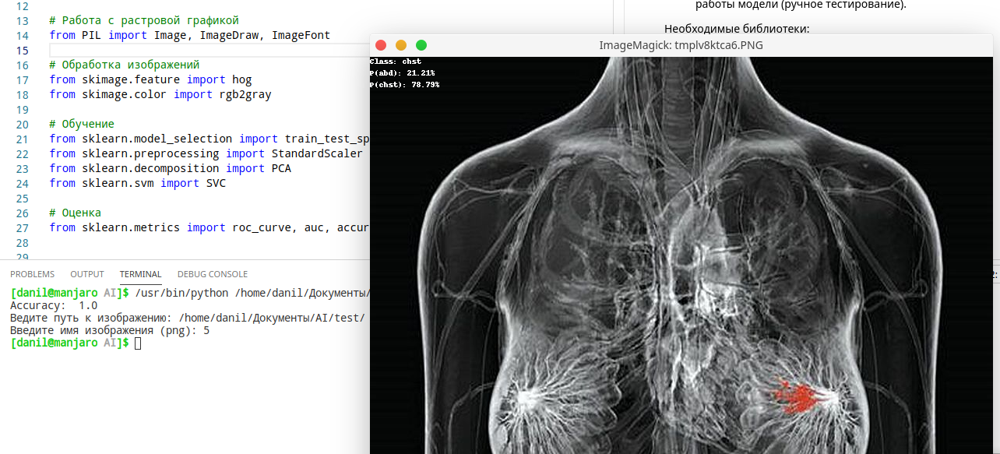

# О проекте
Это небольшой проект на Python, который с помощью метода опорных векторо(SVM/sklearn) классифицирует изображения ренгенов грудной клетки и брюшной полости.

Проект состоит из следующих компонентов:
1. SVM.py - запускаемое консольное приложение.
2. /train - папка, где хранятся все изображения, необходимые для классификации.
3. /test - в этой папке хранятся изображения, которые можно использовать для проверки работы модели (ручное тестирование).

Необходимые библиотеки:
- numpy
- pandas
- matplotlib
- sklearn
- skimage
- PIL

 

